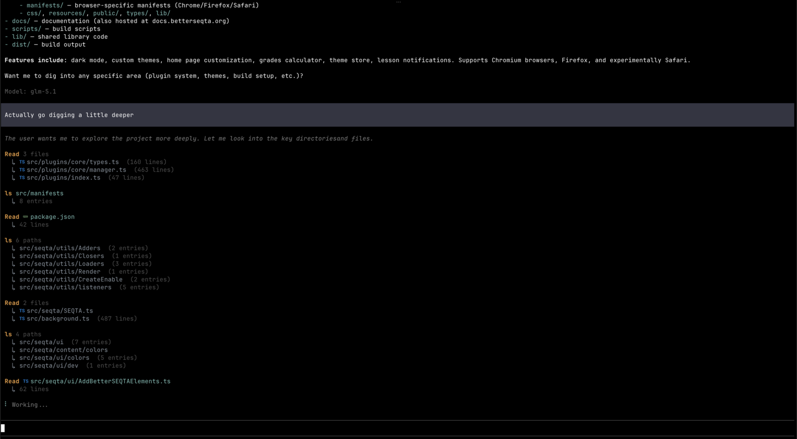

# pi-droid-ui

A Droid-inspired, compact TUI extension for [pi](https://github.com/mariozechner/pi) — the terminal coding agent. Enhances the built-in tool rendering with syntax highlighting, tree views, split-view diffs, Nerd Font icons, and a tighter layout.



## Features

Per-tool rendering overrides:

- **read** — compact header, collapses consecutive reads of the same file into a grouped view
- **bash** — colored exit status + output preview
- **ls** — compact summary (`N entries`), batched across consecutive calls
- **find** — grouped results with file-type icons, batched across consecutive calls
- **grep** — match counts, batched across consecutive calls
- **write** — Shiki syntax-highlighted new-file preview; split-view diff when overwriting
- **edit** — split-view diff with word-level emphasis

Style is compact and Droid-inspired: `↳` result prefixes, no background tinting, terminal-default colors.

## Requirements

- [pi](https://github.com/mariozechner/pi) installed globally (`@mariozechner/pi-coding-agent`)
- A [Nerd Font](https://www.nerdfonts.com/) terminal for the file-type icons
- A truecolor-capable terminal for Shiki highlighting

## Install

1. **Clone the extension into pi's extensions directory and install deps:**

   ```bash
   git clone https://github.com/SethBurkart123/pi-droid-ui ~/.pi/agent/extensions/droid-ui
   cd ~/.pi/agent/extensions/droid-ui
   npm install
   ```

2. **Install the bundled theme** (required for the clean, flat look in the screenshot — pi's default themes use tinted green / red backgrounds for tool calls which clash with this plugin's rendering):

   ```bash
   bash install-themes.sh
   ```

   Then in `~/.pi/agent/settings.json` set:

   ```json
   "theme": "dark-flat"
   ```

   (or `light-flat` for the light variant). You can also switch in-session with `/theme dark-flat`.

3. **Restart pi.** The extension auto-loads from `~/.pi/agent/extensions/`.

## How it works

On load, the extension:

1. Runs a one-time patch on pi's `tool-execution.js` to reduce vertical padding around tool boxes (`Box(1, 1, …)` → `Box(1, 0, …)`). See [`src/patch.ts`](src/patch.ts).
2. Registers custom renderers for each built-in tool using pi's extension API.
3. Hooks `tool_execution_start` and `session_start` events to drive cross-call batching (e.g. grouping consecutive `find`/`grep` calls into one block).

If you update pi and the padding looks off again, re-run:

```bash
bash ~/.pi/agent/extensions/droid-ui/patch-pi.sh
```

## Themes

The plugin's renderers are theme-aware — foreground colours (`dim`, `muted`, `success`, `error`, `border`, etc.) are pulled from whichever pi theme is active. Tool-call backgrounds are the one thing it can't neutralise by itself, which is why the bundled `dark-flat` / `light-flat` themes exist: they're straight copies of pi's defaults with the three `toolPendingBg` / `toolSuccessBg` / `toolErrorBg` slots set to empty string (terminal default).

If you use a different theme, make sure its tool-bg keys are empty strings or the plugin will render on top of a tinted block.

## Project layout

```
index.ts                 Entry point — registers everything
themes/                  Bundled pi themes (flat backgrounds)
  dark-flat.json
  light-flat.json
install-themes.sh        Copies bundled themes into ~/.pi/agent/themes
patch-pi.sh              Re-applies pi tool-execution patches if they drift
src/
  patch.ts               Runtime patch of pi's tool-execution padding
  batching.ts            Cross-call batching state (find/grep/read grouping)
  terminal.ts            Width, truncation, path shortening helpers
  ansi.ts                ANSI escape helpers + theme colour wiring
  highlight.ts           Shiki-based syntax highlighting
  icons.ts               Nerd Font icon map
  language.ts            Extension → language mapping for Shiki
  config.ts              Shared rendering config
  diff/                  Split-view diff renderer (parse / split / inject / unified)
  renderers/             Shared renderers (find-style list)
  tools/                 Per-tool renderers (read, bash, ls, find, grep, write, edit)
```

## License

MIT — see [LICENSE](LICENSE).
